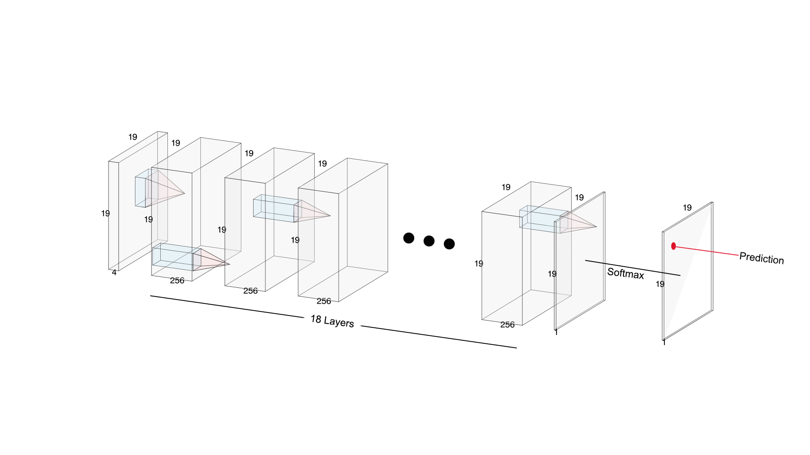
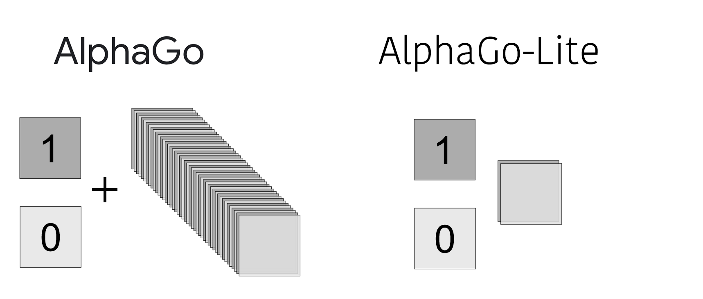

# AlphaGo-Lite

**AlphaGo-Lite** is a simplified implementation of an AI Go player inspired by AlphaGo, providing a lightweight yet powerful Go-playing AI engine.

**Why re-building AlphaGo in 2025?** 

The training of AlphaGo originally used **50 GPUs** and took 3 weeks of time in 2016. This project can be trained on a PC with a single higher-division GPU within a 1-2 weeks. This project serves a practice and educational purpose. Implementation guidance and comments in source code will be provided once I finish this project myself. 

## Pinciple

The original paper published by DeepMind: [Nature: Mastering the game of Go with deep neural networks and tree search](https://www.nature.com/articles/nature16961)

Similarly, we use deep convolutional neural networks to enable complex inference. In one sentence, AlphaGo takes a 19x19x48 tensor as input, that is 46 information matrices + a zero-matrix + a one-matrix, but AlphaGo-Lite takes only 2 information matrices + a zero-matrix + a one-matrix. That makes AlphaGo-Lite **24 times** more light-weighted than AlphaGo. 



### Training

The training of AlphaGO-Lite has 3 phases:

#### Phase 1: Supervised Learning

The goal is to mimic the moves of human experts. The neural network learns to predict the probability distribution of a human expert’s next move based on the current game board, represented as the probability of playing at each point on the board. Supervised learning serves as a foundation, enabling the model to quickly achieve an acceptable performance.

#### Phase 2: Reinforcement Learning

In this phase, AlphaGo-Lite plays against itself. Each game provides feedback in the form of rewards (e.g., winning or losing the match), enabling the model to discover better policies and optimize its decision-making process. Because we want AlphaGo-Lite to be better than human players, the self-play games help the model transcend human-like play and develop more advanced policies.

#### Phase 3: Value Network

The final phase introduces the value network, which estimates the probability of winning from any given board position. Unlike the policy network, which predicts the next move, the value network evaluates the entire board. This provides a deeper understanding of the game dynamics, allowing the model to assess long-term strategies and outcomes. The value network is trained using the outcomes of self-play games, learning to map board states to their eventual results. This network will finally be used in the Monte-Carlo Tree Search (MCTS) to choose the move that leads to the highest chance to win. 

### Dicision Making

#### Monte-Carlo Tree Search (MCTS)

Monte-Carlo Tree Search (MCTS) is the decision-making engine in AlphaGo-Lite, using the value networks to evaluate moves and select the most promising ones.
## Installation

### Clone the Repository
```bash
git clone https://github.com/yourusername/AlphaGo-Lite.git
cd AlphaGo-Lite
```

### Install Dependencies

#### Install Python Dependencies

1. [Install PyTorch](https://pytorch.org/get-started/locally/)

2. Install other Python dependencies:
```bash
pip install h5py matplotlib numpy
```

#### Build the Game Core
1. Navigate to the `GoGame-Core` submodule:
   ```bash
   cd GoGame-Core
   ```
2. Build the C++ core:
   ```bash
   cd src
   mkdir build && cd build
   cmake ..
   make
   ```

3. Verify the core:
   ```bash
   ./GoGame-Core
   ```
4. Navigate back to the root directory:
   ```bash
   cd ../../
   ```

### Setting Up Datasets

1. I recommend: [Joe's Go Datebase](https://pjreddie.com/projects/jgdb/)
2. If you downloaded the dataset from recommended site, un-zip the downloaded file under root directory and change directory name to "rawData". There are about 500,000 files, organized in sub-folder, each containing 1000 files.
3. If you prepared your own dataset, place your SGF datasets in the `RawData/sgf` directory and divide your dataset to "RawData/sgf/train" and "RawData/sgf/test"
4. The SGF files cannot be directly used by the neural net, so they have to be processed to matrices.
5. Use the provided Bash scripts to preprocess and merge datasets:
   ```bash
   ./processSGF.sh process
   ./processSGF.sh merge train
   ./processSGF.sh merge test
   ```
   Notice that it may take up to a few days to process.

## Usage

### Train the Model

#### Phase 1: Supervised Training
1. Run the training script:
   ```bash
   python python/TrainCNN.py
   ```
   or more safely:
   ```bash
   nohup python python/TrainCNN.py
   ```

2. Monitor the accuracy and loss as the model trains. The CNN should be able to achieve 32% under the recommended dataset.

#### Phase 2: Reinforcement Training

Working on this...

#### Phase 3: Value Network

Working on this...

### Export the Model

Convert the trained PyTorch model to ONNX:
```bash
python python/export_onnx.py
```

## File Structure

```plaintext
AlphaGo-Lite/
├── GoGame-Core          # Board-keeping core, written in C++
├── cpp                  # C++ Module, Python is too slow
├── python               # Everything about the CNN
├── processSGF.sh        # RawData -> Dataset magic
├── RawData              # SGF files and processed HDF5 datasets
│   ├── sgf
│   │   ├── test
│   │   ├── train
│   │   └── val
├── Dataset              # Merged Dataset - Ready to be loaded
│   ├── test             # Test set
│   ├── train            # Train set
└── README.md
```

## Contributing

1. Fork the repository.
2. Create a feature branch:
   ```bash
   git checkout -b feature-name
   ```
3. Commit your changes:
   ```bash
   git commit -m "Description of changes"
   ```
4. Push to your branch:
   ```bash
   git push origin feature-name
   ```
5. Submit a pull request.

## License

This project is licensed under the MIT License. See the [LICENSE](LICENSE) file for details.

## Acknowledgments

- Inspired by [DeepMind's AlphaGo](https://deepmind.com/research/highlighted-research/alphago).
- Built with love for the Go community and all human/AI players.

---

Enjoy playing and improving your Go skills with **AlphaGo-Lite**! Feel free to reach out with suggestions or contributions!
